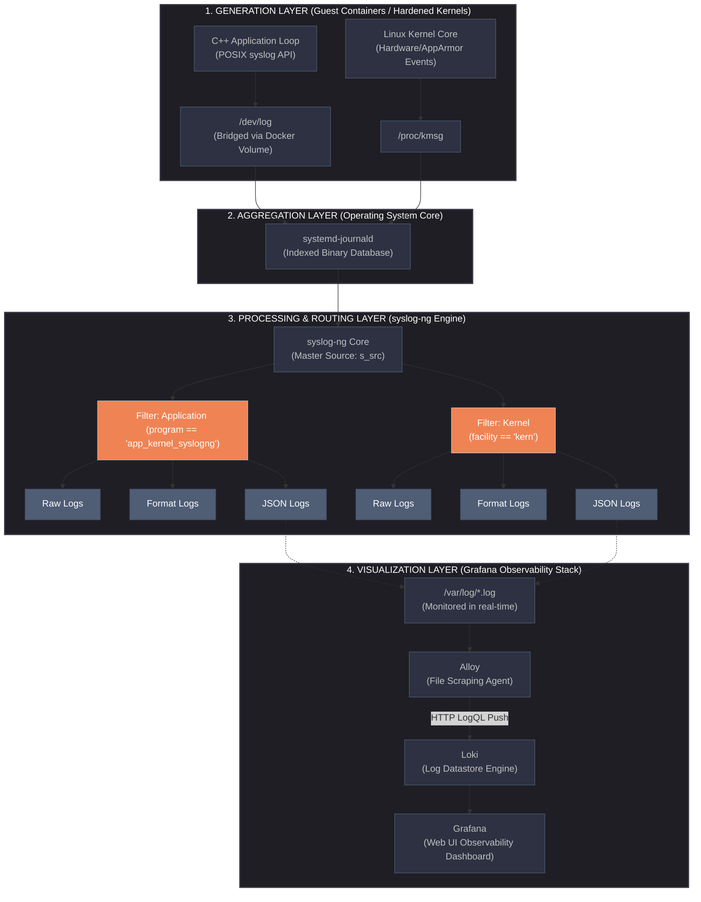

# Structured-Log-Orchestration
This project is to get the lifecycle of application and system logs,moving from isolated container runtimes to central cloud-native dashboards using syslog-ng, Grafana Alloy, Loki, and Grafana.

### Architecture Diagram:

### Architecture Overview:

*   **Layer 1: Generation Layer**
    *   **C++ Application:** Loops continuously, sending logging text using standard POSIX `syslog` calls.
    *   **Linux Kernel:** Captures low-level security violations (AppArmor) and driver messages at `/proc/kmsg`.
    *   **Docker Isolation Bridge:** Maps `/dev/log` out of the container so the host can process isolation events safely.

*   **Layer 2: Aggregation Layer**
    *   **systemd-journald:** The central nervous system for host logs. It catches payloads from both kernel space and user space, converting them into structured, indexed binary journal blocks.

*   **Layer 3: Processing & Routing Layer**
    *   **syslog-ng Engine:** Reads directly from the systemd journal via `s_src`.
    *   **Conditional Filters:** Evaluates operational scopes dynamically (`program` vs `facility`) to split traffic cleanly.
    *   **Multiplexed Destinations:** Outputs data into three formats at once. 
        *   **Raw Logs:** Intact, unmodified historical string payloads.
        *   **Formatted Logs:** Cleaned, human-readable standard text for immediate terminal inspection.
        *   **JSON Logs (`*_json.log`):** Structured key-value text maps, specifically generated to support clean, queryable ingestion at scale.
          
*   **Layer 4: Dual-Stream Monitoring & Visualization Layer**
    *   **Unified Local Streams:** All three log streams (**Raw**, **Formatted**, and **JSON**) are generated actively under `/var/log/`. This allows developers and sysadmins to tail, track, and contrast text patterns locally for rapid terminal troubleshooting.
    *   **Grafana Alloy Ecosystem Ingestion:** Rather than isolating a single format, Grafana Alloy targets these log types from the `/var/log/` file paths simultaneously.
    *   **Multi-Format Loki Store:** Ingests the complete contextual streams via HTTP LogQL pushes. This allows the cloud stack to store exact raw history alongside highly queryable structured properties.
    *   **Grafana UI Overview:** Renders full visualization metrics across all telemetry variations, ensuring full data audit capability from a single dashboard.
 
## 📂 Repository Layout
```text
├── config/
│   ├── syslog-ng.conf.in   # Master routing engine configurations and filters
│   └── 00-loglevel.conf.in # Dynamic Log Level filteration
├── src/
│   └── main.cpp            # C++ telemetry application loop simulation
├── CMakeLists.txt          # CMake
├── Dockerfile              # Application Container building instruction recipe
├── DEVELOPMENT.md          # Complete, step-by-step setup & deployment guide
└── README.md               # Pipeline overview and architecture
```

## 🚀 Quick Start
Ready to build and deploy this infrastructure? 

👉 **[Click here to view the step-by-step Deployment & Setup Guide (DEVELOPMENT.md)](./DEVELOPMENT.md)**
